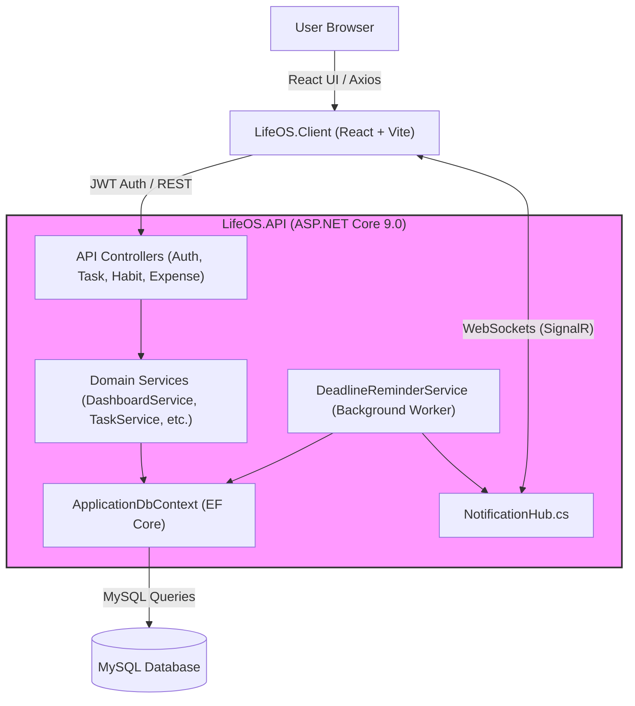

# LifeOS

LifeOS is a comprehensive full-stack application designed to serve as a "personal operating system." It provides a unified dashboard for managing various aspects of a user's life, including productivity (tasks and habits), financial health (expenses and budgeting), and mental clarity (decision-making logs and coach feedback).

## 1. What is this repo?
The `swaliha-Mujawar-CM-AC/LifeOS` repository contains a self-improvement platform built with a modern web stack: an **ASP.NET Core 9.0** Web API for the backend and a **React + Vite** frontend. Unlike simple "To-Do" apps, LifeOS implements a holistic approach by quantifying a user's progress through a multi-faceted scoring system (Habit, Task, and Financial scores) which aggregates into an "Overall Life Score."

The system supports multiple user roles:
- **Users**: Track their own tasks, habits, and expenses.
- **Coaches**: Monitor assigned users, provide feedback, and review progress.
- **Admins**: Approve coach applications and manage the user base.

Key functionalities include real-time notifications via SignalR, JWT-based authentication with security questions, and automated background services that monitor task deadlines and trigger reminders.

## 2. How all main components connect
The architecture follows a standard client-server pattern with a clear separation between the presentation layer and the business logic.

- **Presentation Layer (`LifeOS.Client/`)**: A Vite-powered React application. It uses functional components and hooks to manage state. Real-time updates for notifications are handled by a SignalR client connection established in `LifeOS.Client/src/App.jsx`.
- **Application Layer (`LifeOS.API/`)**: An ASP.NET Core Web API.
    - **Controllers**: Located in `LifeOS.API/Controllers/`, these act as the entry points for the frontend, handling HTTP requests for specific domains (e.g., `ExpenseController.cs`, `HabitController.cs`).
    - **Services**: Found in `LifeOS.API/Services/`, these contain the core business logic. For instance, `LifeOS.API/Services/DashboardService.cs` calculates the complex weighted scores displayed on the user dashboard.
- **Data Layer (`LifeOS.API/Data/`)**: Uses Entity Framework Core (EF Core) with the Pomelo MySQL provider. The `LifeOS.API/Data/ApplicationDbContext.cs` defines the schema and handles seeding of initial data.
- **Infrastructure**:
    - **SignalR**: The `LifeOS.API/Hubs/NotificationHub.cs` facilitates bidirectional communication for instant alerts.
    - **Background Tasks**: `LifeOS.API/Services/DeadlineReminderService.cs` runs as a hosted service to check for approaching deadlines.



## 3. Repository Structure

```shell
swaliha-Mujawar-CM-AC/LifeOS/
├── LifeOS.API/
│   ├── Controllers/
│   │   ├── AuthController.cs
│   │   ├── DashboardController.cs
│   │   ├── HabitController.cs
│   │   └── TaskController.cs
│   ├── Data/
│   │   ├── ApplicationDbContext.cs
│   │   └── DbSeeder.cs
│   ├── Hubs/
│   │   └── NotificationHub.cs
│   ├── Middleware/
│   │   └── GlobalExceptionMiddleware.cs
│   ├── Models/
│   │   ├── Habit.cs
│   │   ├── TaskItem.cs
│   │   └── User.cs
│   ├── Services/
│   │   ├── DashboardService.cs
│   │   ├── DeadlineReminderService.cs
│   │   └── JwtTokenService.cs
│   ├── Program.cs
│   ├── appsettings.json
│   └── LifeOS.API.csproj
├── LifeOS.Client/
│   ├── src/
│   │   ├── components/
│   │   │   └── dashboard/
│   │   ├── pages/
│   │   │   ├── AuthPage.jsx
│   │   │   ├── UserDashboard.jsx
│   │   │   └── UserTasks.jsx
│   │   ├── App.jsx
│   │   └── main.jsx
│   ├── package.json
│   └── vite.config.js
├── LifeOS.sln
└── README.md
```

## 4. Other important information

### The Scoring Algorithm
One of the most interesting aspects of the codebase is the scoring logic found in `LifeOS.API/Services/DashboardService.cs`. It calculates a user's performance across three pillars:
1.  **Habit Score**: Calculated by comparing total `HabitLogs` against the product of active days and total habits. It's a measure of consistency.
2.  **Task Score**: Uses a weighted "margin" approach. If a task is completed >4 hours before the deadline, it grants 10 points. If completed between 30 mins and 4 hours before, 7 points. Completed within 30 mins grants 5 points, and late completions grant 3.
3.  **Financial Score**: Directly tied to the savings ratio (Savings / Total Income).

### Real-Time Infrastructure
The API utilizes SignalR for push notifications. In `LifeOS.API/Program.cs`, the service is registered and mapped to `/hubs/notifications`. On the client side, `LifeOS.Client/src/App.jsx` establishes a connection and joins a specific "User Group" based on the logged-in user's ID. This allows the backend to send targeted notifications (e.g., coach feedback or deadline alerts) without the client needing to poll the server.

### Security and Authentication
Authentication is implemented using JWT (JSON Web Tokens). A unique feature visible in `LifeOS.API/Controllers/AuthController.cs` is the "Forgot Password" flow, which uses a hashed `SecurityAnswer` stored in the `User` model (`LifeOS.API/Models/User.cs`). Password hashing is handled via **BCrypt.Net-Next**, ensuring that sensitive credentials are never stored in plain text.

### Database Configuration
The project uses **MySQL** via the Pomelo Entity Framework Core provider. The connection string and basic logging levels are managed in `LifeOS.API/appsettings.json`. The migration history in `LifeOS.API/Migrations/` shows a highly iterative development process, evolving from basic task tracking to adding complex user roles, scoring, and budgeting features.

### Frontend Tech Stack
The client is a modern React application utilizing:
- **Vite**: For fast development and bundling.
- **React Hot Toast**: For non-blocking UI notifications.
- **SignalR Client**: For the WebSocket connection to the .NET backend.
- **CSS Variables**: Extensive use of CSS variables for theming and layout management, visible in the styles referenced in `LifeOS.Client/src/App.jsx`.
